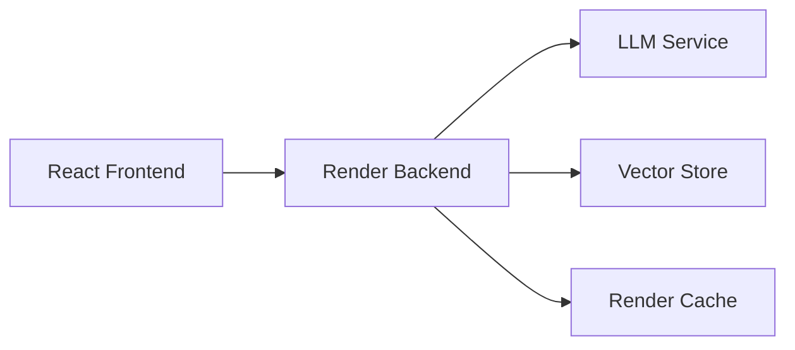

# Interactive AI Portfolio 🤖

I’ve developed an AI-powered conversational portfolio that invites visitors to engage directly with an intelligent assistant fully versed in my work, experience, and areas of expertise. Through its interactive chat interface, users can ask questions about my past projects, seek insights into my professional journey, or explore the skills I’ve honed over the years—and receive thoughtful, context-aware responses in real time. This dynamic showcase not only highlights my accomplishments but also fosters meaningful dialogue, allowing each visitor to discover exactly how my background and capabilities align with their interests.

## ✨ Key Features

- 🤖 **Interactive AI Assistant**: Engage visitors with personalized, context-aware conversations
- 🚀 **Real-time Streaming**: Fluid, chat-like experience with streaming responses
- 🎨 **Modern UI**: Clean, responsive design focused on conversation

## 🏗 Architecture

### Tech Stack

- **Frontend**: React + Vite, TailwindCSS, Framer Motion
- **Backend**: FastAPI, PostgreSQL + pgvector, Redis

## 🚀 Quick Start

1. Create a new repository from this template and clone it
2. Add the necessary files to frontend/public and change the config.json file to your own content - [Config Setup Guide](frontend/CONFIGURATION.md)
3. Run "docker compose build" and then "docker compose up" to start the containers and enjoy it on [localhost](http//:localhost:3000)
4. Deploy to [fly.io](fly.io) or set up locally- [Backend Setup Guide](backend/README.md)
5. Deploy to [vercel.com](vercel.com) or set up locally- [Frontend Setup Guide](frontend/README.md)

## 🤝 Contributing

Contributions are welcome! Please feel free to submit a Pull Request.

## 📝 License

This project is licensed under the MIT License - see the [LICENSE](LICENSE) file for details.
