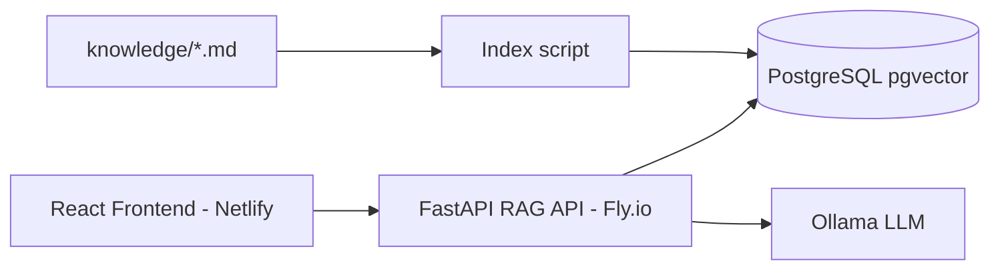

# Interactive AI Portfolio

An AI-powered conversational portfolio where visitors chat with an assistant grounded in your background, experience, and projects. Built with React, FastAPI, RAG over personal knowledge, and **Ollama** for local or self-hosted inference.

## Architecture



## Tech stack

| Layer | Stack |
|-------|--------|
| Frontend | React, Vite, TailwindCSS, Framer Motion |
| Chat API | FastAPI, httpx, pgvector |
| Inference | Ollama (`llama3.2:3b`, `nomic-embed-text`) |
| Legacy | `BackendV2/` (Vercel + Gemini) — deprecated |

## Getting started

### 1. Clone and env

```bash
git clone https://github.com/ZivHoch/myPortfolio.git
cd myPortfolio
cp env.example .env
# Edit .env with your GitHub username and paths
```

### 2. Frontend + API (one command)

From the repo root or `frontend/`:

```bash
cd frontend
npm install
npm run dev
```

This starts **Vite** (http://localhost:5173) and the **FastAPI backend** (http://localhost:8000) together.

Frontend only: `npm run dev:web` — API only: `npm run dev:api`

Set in `frontend/.env`:

```env
VITE_GITHUB_USERNAME=your_github_username
VITE_BACKEND_URL=http://localhost:8000
```

### 3. Ollama

Install [Ollama](https://ollama.com) and pull models:

```bash
ollama pull llama3.2:3b
ollama pull nomic-embed-text
```

### 4. Backend setup (first time)

```bash
cd backend
python3 -m venv venv && source venv/bin/activate
pip install -r requirements.txt

# Postgres + Redis (optional Redis for now)
docker compose up -d

# Sync knowledge from frontend/knowledge
python scripts/sync_knowledge.py

# Index into pgvector (requires Postgres)
python scripts/index_knowledge.py
```

Then use `npm run dev` from `frontend/` (starts the API automatically).

- Frontend: http://localhost:5173  
- API docs: http://localhost:8000/docs  

Without Postgres, chat still works using full-markdown fallback context.

### 5. Customize knowledge

Edit markdown in [`frontend/knowledge/`](frontend/knowledge/), then:

```bash
python backend/scripts/sync_knowledge.py
python backend/scripts/index_knowledge.py
```

## Deployment

### Frontend (Netlify)

| Field | Value |
|-------|--------|
| Base directory | `frontend` |
| Build command | `npm run build` |
| Publish directory | `dist` |

Env: `VITE_GITHUB_USERNAME`, `VITE_BACKEND_URL` (your Fly API URL).

### Backend (Fly.io)

See [`backend/README.md`](backend/README.md) and [`backend/fly.toml`](backend/fly.toml). Run Ollama on the same machine or a private network reachable from the API.

Set Fly secrets: `OLLAMA_BASE_URL`, `FRONTEND_URL`, `DATABASE_URL`, Postgres credentials.

## Contributing

Pull requests and issues are welcome.

## License

MIT — see [LICENSE](LICENSE).

Made with care by Ziv Hochman
