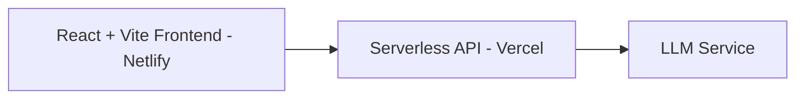

# Interactive AI Portfolio 🤖

[](https://reactjs.org/)
[](https://vitejs.dev/)
[](https://www.netlify.com/)
[](https://vercel.com/)
[](https://opensource.org/licenses/MIT)

An AI-powered conversational portfolio that allows visitors to interact with an intelligent assistant trained on my background, experience, and projects.  
Instead of browsing static sections, users can ask questions and receive real-time, context-aware answers — making the portfolio a living, interactive experience.

---

## ✨ Key Features

- 🤖 **Interactive AI Assistant** — Personalized, context-aware conversations
- ⚡ **Streaming Responses** — Real-time chat experience
- 🎨 **Modern UI** — Built with React, Vite, and TailwindCSS
- ☁️ **Serverless Backend** — Deployed on Vercel

---

## 🏗 Architecture



---

## 🛠 Tech Stack

### Frontend

- React
- Vite
- TailwindCSS

### Backend

- Vercel Serverless Functions
- Node.js

---

## 🚀 Getting Started (Local Development)

### 1. Clone the Repository

```bash
git clone https://github.com/ZivHoch/myPortfolio.git
cd myPortfolio
```

---

### 2. Environment Variables

#### Frontend (`frontend/.env`)

```env
VITE_GITHUB_USERNAME=your_github_username
```

> Note: Vite injects env vars at build time. Restart the dev server after changes.

#### Backend (`backend/.env` or Vercel dashboard)

See `backend/README.md` for backend configuration.

---

### 3. Run Locally

#### Frontend

```bash
cd frontend
npm install
npm run dev
```

#### Backend

```bash
cd backend
npm install
vercel dev
```

---

### 4. Local URLs

- Frontend: http://localhost:5173
- Backend: http://localhost:3000

---

## 🌍 Deployment

### Frontend (Netlify)

| Field             | Value           |
| ----------------- | --------------- |
| Base directory    | `frontend`      |
| Build command     | `npm run build` |
| Publish directory | `dist`          |

Add environment variables in Netlify dashboard:

```
VITE_GITHUB_USERNAME=your_username
```

---

### Backend (Vercel)

Deploy the backend as serverless functions.

Add required environment variables via the Vercel dashboard.

---

## 🧪 Customization

To customize the content the assistant is trained on, edit:

```
frontend/config.json
```

Full guide:

```
frontend/CONFIGURATION.md
```

---

## 🤝 Contributing

Pull requests and issues are welcome!

---

## 📝 License

This project is licensed under the MIT License — see the [LICENSE](LICENSE) file for details.

---

Made with ❤️ by Ziv Hoch
